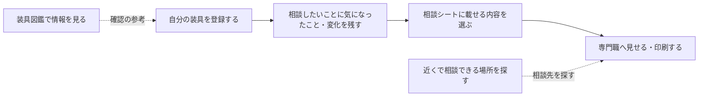

# 装具びより — 下肢装具サポートPWA

「装具びより」は、下肢装具を使っている方が、ご自身の装具や日々の記録、相談したいことを整理するための個人用アプリです。

装具を使っていて感じたことを少しずつ残し、医師、義肢装具士、理学療法士などの専門職へ相談するときに、伝えたい内容をまとめた「相談シート」を作れます。

入力した内容が自動で外部へ送信されることはありません。ご自身のペースで記録し、必要なときに画面や印刷した相談シートを見せてお使いください。

## アプリを開く

[装具びよりを開く](https://kazunyon.github.io/kasisougu/)

ご利用には、あらかじめ登録されたメールアドレスとパスワードが必要です。アプリ内からの新規利用登録には、現在対応していません。

## はじめにお読みください

このアプリは、相談の準備や日々の振り返りをお手伝いするものです。

- 装具が身体に合っているか、処方が適切か、歩いてよい状態かを判定するものではありません。
- 痛み、傷、しびれ、腫れ、転倒など、身体や安全に関わる心配がある場合は、アプリの記録だけで判断せず、医師や義肢装具士などの専門職へご相談ください。
- 記録や相談シートは、診断書、処方箋、医療記録の代わりになるものではありません。
- 保存や印刷は、ご自身で内容を確認してから行ってください。

## アプリの概要

装具の情報と日々の記録をもとに、専門職へ相談したい内容を一つのシートへまとめられます。

## 基本的な使い方

### 1. ログインします

登録済みのメールアドレスとパスワードを入力します。ログインすると、ご自身の装具や記録を確認できるようになります。

### 2. 「自分の装具」を登録します

現在使っている装具、試している装具、以前使っていた装具を分けて登録できます。左右、装具の種類、作製日、製作所、価格や利用した制度、写真なども、分かる範囲で残せます。

すべての項目を一度に入力する必要はありません。まずは装具の名前と種類など、分かるところから始めてください。

### 3. 気になったこと・変化を残します

「相談したいこと」から、装具ごとに「気になったこと・変化」を登録します。気づいた日、分類、対応状況、内容、対応内容などを残せます。

### 4. 相談シートを作ります

装具、気になったこと・変化、写真の中から、相手に見せたい内容を選びます。いったん下書きとして保存し、内容を確認してから確定できます。

確定した相談シートは画面で見せるほか、ブラウザの印刷機能を使って印刷したり、PDFとして保存したりできます。アプリから相談先へ自動送信されることはありません。

## 主な画面

| 画面 | できること |
| --- | --- |
| Home（ホーム） | 登録した装具や最近の記録を確認し、相談シート作成へ進めます |
| 自分の装具 | 装具の登録・編集、写真の追加、使用状況の整理ができます |
| 装具図鑑 | 公開記事の検索・比較と、自分で見つけた装具の追加・編集・削除ができます |
| 相談したいこと | 気になったこと・変化を日付や対応状況とともに整理できます |
| 相談シート | 専門職へ見せる内容を選び、下書き・確定・印刷ができます |
| 近くで探す | 登録施設やGoogle Mapsを使って、相談先の候補を探せます |
| Link（リンク集） | 装具に関する参考情報や、ご自身で追加したリンクを確認できます |
| 設定 | 表示名、文字の大きさ、完全バックアップと復元、ログアウトなどを設定できます |

パソコンでは主なメニューが画面の左側に、スマートフォンでは画面の下側に表示されます。「自分の装具」は、スマートフォンでは画面上部のボタンから開けます。

## 装具図鑑について

装具図鑑は「公開されている装具」と「自分で追加した装具」のタブで切り替えます。公開記事は、装具名や製品名から探し、AFO、KAFO、足底装具、靴型装具などの種類で絞り込めます。複数の記事を並べて確認することもできます。「自分で追加した装具」には、気になった装具の名前、概要、特徴、写真URLなどを本人専用の情報として保存し、あとから編集・削除できます。

掲載内容は、装具について知るための参考情報です。ご自身に合う装具の選択や調整は、医師や義肢装具士などの専門職へご相談ください。「未確認」と表示される情報は、登録されている資料だけでは確認できていない項目です。

## 近くで探す

相談先を新しく見つけたいときはGoogle Mapsを開きます。アプリに登録されている施設までの距離を確認したいときは、アプリ内で検索します。

| 画面のタブ | できること |
| --- | --- |
| Google Mapsで探す | Google Mapsを別の画面で開き、指定した住所や現在地の周辺施設を検索します |
| 登録施設から探す | アプリの施設データと、ご自身で保存した候補施設を検索し、直線距離を表示します |

### 周辺の施設を見つける（Google Mapsで探す）

1. 「Google Mapsで探す」タブを開きます。
2. 本人設定に保存した登録住所が「検索する住所」に表示されます。別の住所から探す場合は入力し直します。現在地の周辺を探す場合だけ「現在地を使用」を押し、位置情報の利用を許可します。
3. 「リハビリを探す」「整形外科を探す」「義肢装具店を探す」「装具外来を探す」など、探したい施設種別のボタンを押します。
4. 施設種別と、番地まで含む入力住所を検索語にしたGoogle Mapsの検索結果が開きます。
5. 表示された候補から行きたい施設を選びます。アプリが特定の施設や目的地を自動決定することはありません。現在地の周辺を探す場合だけ、先に「現在地を使用」を選びます。

住所は保存しなくてもGoogle Mapsの検索に使えます。次回も使う場合は「この住所を保存」を押します。Google Mapsが開かないときは、表示される「Google Mapsをブラウザで開く」リンクを押してください。

検索結果はGoogle Maps側に表示されます。アプリの施設一覧へ自動で取り込まれることはありません。施設を調べるだけでも利用できます。

### 見つけた施設をアプリに残す（任意）

後からアプリで確認したい施設は、ご自身で候補施設として保存できます。

1. アプリへ戻り、「Google Mapsで探す」タブの下にある「候補施設を登録」を押します。
2. 「施設名」「施設種別」「確認日」を入力します。所在地、電話番号、Google Maps URL、相談したい内容、メモは任意です。
3. 「候補施設を保存」を押します。
4. 保存した施設を見るときは、「登録施設から探す」タブへ切り替え、「登録住所から検索」を押して検索します。

保存後も、選んだ目的や検索範囲によっては表示されません。見つからないときは、探す目的を「すべての登録施設」、検索範囲を「距離制限なし」にして検索してください。候補施設は検索結果の「編集」「削除」から管理できます。

### アプリ内の施設までの距離を調べる（登録施設から探す）

ここでいう「登録施設」は、アプリに用意された施設データと、ご自身で保存した候補施設です。Google Mapsに掲載されているすべての施設を検索する機能ではありません。

1. 「登録施設から探す」タブを開きます。
2. 出発地として「現在地を使う」または「登録住所を使う」を選びます。登録住所を使う場合は、先に「Google Mapsで探す」タブで住所を入力し、「この住所を保存」を押してください。
3. 探す目的と検索範囲を選び、「直線距離を調べる」を押します。目的は装具の製作・修理・適合確認・リハビリ・制度相談、範囲は10km・30km・50km以内・距離制限なしから選べます。
4. 条件に合う施設が、直線距離の近い順に表示されます。施設名、所在地、連絡先などを確認します。
5. 移動経路を調べたい施設の「Google Mapsで経路を確認」を押します。保存した住所を出発地として、徒歩経路を表示します。現在地を出発地にしたい場合は、先に「現在地から検索」を押してください。

直線距離は、実際の道路距離や移動時間とは異なります。所在地を入力していない候補施設や、所在地の位置を確認できなかった候補施設は、距離による絞り込みができず、一覧の後ろに「所在地の位置未確認」と表示されます。

候補施設の目的による絞り込みは、保存した「施設種別」をもとに行います。実際にその相談へ対応していることを示すものではありません。利用前に、希望する相談への対応や予約の要否などを施設へ確認してください。

現在地はアプリに保存しません。住所の保存時や距離の計算時など、住所の位置を確認する際は住所が国土地理院へ送信されます。Google Mapsの検索・経路リンクを開くと、検索語や住所、出発地・目的地の座標などがGoogle Mapsへ送信されます。

## リンク集

装具に関する参考サイトや記事を、アプリから別のタブで開けます。また、ご自身で見つけた病院のお知らせや参考ページなどを、名前・URL・メモと一緒に保存できます。

外部サイトの内容や安全性は、それぞれの運営元が管理しています。リンク先で個人情報を入力するときは、サイト名やURLをご確認ください。

## データの保存と取り扱い

安心してお使いいただくため、現在の保存方法について次の点をご確認ください。

- 入力内容は、基本的に「保存」ボタンを押したときにオンラインで保存されます。
- 入力途中の内容は、画面を移動しても残る場合がありますが、再読み込みやブラウザ終了後まで自動保存されるとは限りません。
- ログイン状態は、画面を再読み込みすると解除される場合があります。
- 写真は本人用の非公開領域へ保存し、ログインした状態で表示します。JPEG、PNG、WebPに対応し、1枚10MB以下、装具または記録ごとに最大10枚を目安としています。
- アプリの画面表示に必要なファイルは、端末へ一時的に保存されることがあります。ただし、本人の記録や写真を通信のない状態で使えることは保証していません。
- 「完全バックアップを作る」では、本人設定、装具、気になったこと・変化、写真、相談シート、自分用リンク、保存した候補施設を1つのJSONファイルへ保存します。以前の使用記録や困りごと・希望もバックアップに含まれます。写真を含むため、ファイル容量が大きくなる場合があります。
- バックアップファイルには入力内容と写真がそのまま含まれます。他人へ共有せず、安全な場所に保管してください。
- 復元すると現在のデータを削除せずに内容を追加します。本人設定はバックアップの内容を反映します。同じバックアップをもう一度選んでも二重登録はしません。
- 同じ記録を複数の画面や端末から同時に変更した場合は、上書きを避けるため再読み込みをお願いすることがあります。

## 削除するときの注意

削除の前には確認画面が表示されます。内容をよくご確認ください。

相談シートを削除すると、そのシート用に保存された写真も削除されます。元の装具や以前の使用記録に保存されている写真は、別に管理されています。

## パスワードを忘れた場合

ログイン画面の「パスワードを忘れた方・ログインできない方」から、再設定メールを送信できます。

メールに記載されたリンクを開き、新しいパスワードを設定した後、ログイン画面からもう一度ログインしてください。この操作でアカウントや保存済みの本人データが削除されることはありません。

メールが届かない場合は、迷惑メールフォルダーと入力したメールアドレスをご確認ください。再設定画面を途中で閉じたり再読み込みしたりした場合は、もう一度メールを送信してください。

## 現在対応していないこと

次の機能には、現在対応していません。

- アプリ内での新規利用登録やアカウント削除
- 入力途中の内容をオフラインで保存し、通信回復後に自動送信する機能
- 相談シートの自動送信
- 装具の適合、処方、歩行可否などの医学的な判定
- 登録施設の対応内容やバリアフリー設備を保証すること

機能や表示は、今後の改善により変更される場合があります。大切な内容は相談前に画面で確認し、必要に応じて印刷やPDF保存もご利用ください。
